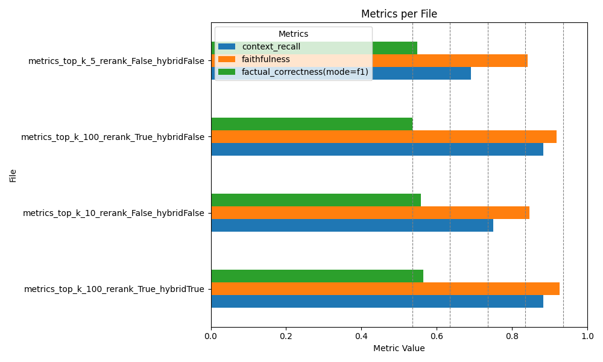
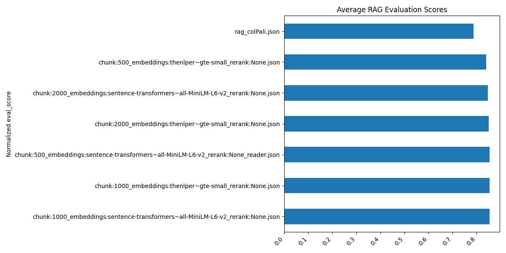
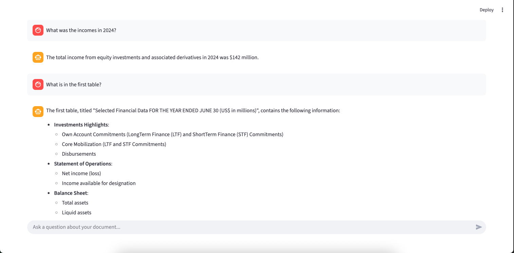

# Multimodal RAG (Retrieval-Augmented Generation)

This project focuses on building a Multimodal Retrieval-Augmented Generation (RAG) system along with a simple web interface that allows users to interact with the RAG agent.

To evaluate the system, the IFC Annual Financial Report (PDF) was used as the primary knowledge source. The project explores different vector stores, retrieval strategies, and multimodal approaches to improve answer quality and reliability.
Vector Stores and Retrieval Methods

## Vector Stores
The following embedding vector stores were implemented and evaluated:
- Faiss
- Quadrant
- Byaldi

### FAISS vs Qdrant
FAISS and Qdrant were compared using the same dataset and retrieval settings. While their performance was generally comparable, FAISS slightly outperformed Qdrant in this setup. Additionally, FAISS’s ability to operate fully locally was considered a major advantage for this project.

### Byaldi for Multimodal Storage
Byaldi was used specifically for multimodal storage via ColPali, enabling efficient handling of non-textual content such as images and tables.

## Retrieval Strategy and Reranking
The experiments demonstrate that combining the following techniques significantly improves RAG performance:
- Hybrid search (lexical + semantic)
- Retrieval of a larger candidate set and reranking using a dedicated model

The plot below shows improvements across all evaluated metrics:
- Context Recall
- Faithfulness
- Factual Correctness

All three metrics consistently improve when reranking is applied after an initial broad retrieval phase, confirming that retrieving more potentially relevant documents and then refining them leads to better results.

## RAG Evaluation Methodology
In addition to automated metrics, a qualitative evaluation approach was used:
Firstly model generated answers and then second model evaluated the quality of those answers on a scale from 1 to 5.

The evaluation dataset consisted of approximately 30 queries, covering:
- Text-based questions
- Image-based questions
- Table-based questions

Due to the relatively small dataset size, the resulting statistics should be interpreted with caution, as they may contain some degree of subjectivity.

## Multimodal RAG Approaches
Two main approaches were explored to enable multimodal retrieval:

1. Textualization of Visual Content
Images and tables are converted into descriptive text and concise summaries, which are then embedded and stored alongside regular text chunks. This allows multimodal information to be retrieved using standard text-based semantic search.

2. ColPali-Based Visual Retrieval
Using ColPali, the PDF was:
ColPali indexes PDFs in a visual-first way by splitting each page into smaller chunks, treating these chunks as image-like representations, and encoding them with a multimodal embedding model. This approach preserves layout, tables, and charts, improving retrieval for complex documents where structure and visual context matter.

## Web Interface
A simple web application was developed to interact with the final RAG model. The interface allows users to: 
- Ask questions about the document.
- Test the multimodal capabilities of the system.
- Evaluate the final retrieval and generation pipeline in real time.
  

